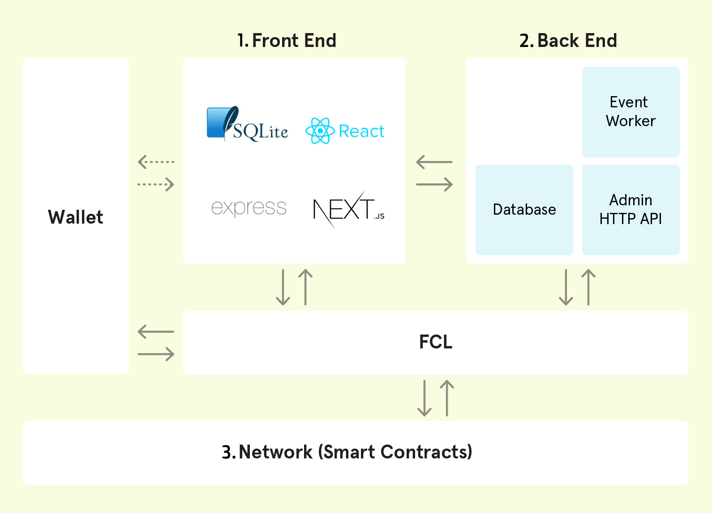

Kitty Items is a complete NFT marketplace modeled after CryptoKitties and built with [Cadence](/candece). Use it to learn how to develop on Flow and as a blueprint for your own marketplace.

> [CryptoKitties](https://www.cryptokitties.co/) is Web3 game that put NFTs on the map. Now developers can make their own NFT marketplace influenced by CryptoKitties.

Throughout this tutorial, Kitty Items will be used to help you understand the concepts behind the Flow blockchain and its programming language Cadence.

After completing this tutorial, you will understand how to deploy smart contracts, mint NFTs, and integrate wallets with Flow’s Client Library.

## 🎬 Live Demo

Before we get going with the tutorial, let's take a look at a [deployed version of Kitty Items](http://kitty-items-flow-testnet-prod.herokuapp.com/).

## Project overview

The project consists of 3 key components:

- Frontend: a static web application based on NextJS
- Backend: an API based on NodeJS
- Cadence: A set of contracts, scrips, and transactions

Here is how it all comes together:

### 1. Web App (Static website) | [kitty-items/web](https://github.com/onflow/kitty-items/tree/master/web)

A true dapp, client-only web app. This is a complete web application built with React that demonstrates how to build a static website that can be deployed to an environment like IPFS and connects directly to the Flow blockchain using `@onflow/fcl`. No servers required. `@onflow/fcl` handles authentication and authorization of [Flow accounts](https://docs.onflow.org/concepts/accounts-and-keys/), [signing transactions](https://docs.onflow.org/concepts/transaction-signing/), and querying data using using Cadence scripts.

### 2. Look Ma, a Web Server! | [kitty-items/api](https://github.com/onflow/kitty-items/tree/master/api)

We love decentralization, but servers are still very useful, and this one's no exception. The code in this project demonstrates how to connect to Flow using [Flow JavaScript SDK](https://github.com/onflow/flow-js-sdk) from a Node JS backend. It's also chalk-full of handy patterns you'll probably want to use for more complex and feature-rich blockchain applications, like storing and querying events using a SQL database (Postgres). The API demonstrates how to send transactions to the Flow blockchain, specifically for minting [Kitty Items](https://github.com/onflow/kitty-items/blob/master/cadence/contracts/KittyItems.cdc) (non-fungible tokens).

### 3. Cadence Code | [kitty-items/cadence](https://github.com/onflow/kitty-items/tree/master/cadence)

[Cadence](https://docs.onflow.org/cadence) smart contracts, scripts & transactions for your viewing pleasure. This folder contains all of the blockchain logic for the marketplace application. Here you will find examples of [fungible token](https://github.com/onflow/flow-ft) and [non-fungible token (NFT)](https://github.com/onflow/flow-nft) smart contract implementations, as well as the scripts and transactions that interact with them. It also contains examples of how to _test_ your Cadence code.
