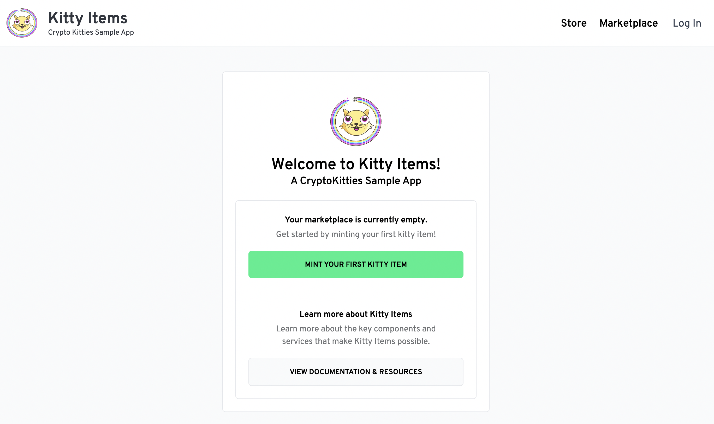

The steps below will help you deploy Cadence smart contracts to the testnet - a hosted Flow blockchain environment for testing. Once deployed, you will spin up local services that interact with your deployed contracts to the testnet.

## Start on testnet

To start the project, with all of its services, run the following:

```sh
npm run dev:testnet
```

You will be asked if you have an existing testnet account, enter `N` to generate a new one:

```sh
? Have you previously created a testnet account using npm run dev:testnet ? (y/N) N
```

You will see newly generated keys and instructions to create and fund your new account:

```
Next steps:

1. Create a new account using the testnet faucet by visiting this URL:
https://testnet-faucet.onflow.org/?key=096..a85&source=ki

2. Copy the new account address from the faucet, and paste it below 👇
⚠️  Don't exit this terminal.
```

Open up the link to the testnet faucet page, complete the captcha challenge, and hit `Create Account`.

> **Note**: This process will take a few seconds. You should see a loading indicator confirming your account is being generated.

Once completed, you will see your new account address (similar to `0x2f915dafac3bd7bf`) next to a confirmation that you received 1,000 FLOW tokens. Hit the `Copy Address` button and return to the terminal and paste your address:

```sh
? Paste your new testnet account address here: 0x2f915dafac3bd7bf
```

Feel free to close the faucet page. Hit enter and the script will complete setting up the project for you. You will see several logs - this is expected. Some noteworthy ones are:

```
ℹ Testnet envronment config was written to: .env.testnet.local

✔ API server started
ℹ Kitty Items API is running at: http://localhost:3000

✔ Storefront web app started
ℹ Kitty Items Web App is running at: http://localhost:3001

✔ Contracts deployed
✔ Admin account initialized
```

As indicated in the logs, your account details are stored in a new file: `.env.testnet.local`. This file will be used whenever you start the service, so you don't have to handle account creation again.

> **Note**: Never commit this file to Git - it contains your private key!

Once all services are started up, you will see the following:

```sh
KITTY ITEMS HAS STARTED
```

Congratulations! Your own instance of Kitty Items is now running locally and wired up to the Cadence contracts deployed to the testnet.

## Open Kitty Items

Open up the web application by visiting [`http://localhost:3001`](http://localhost:3001). It should look like this:



As a first step, you can try minting your first NFT, aka a Kitty Item. Follow the instructions on the page.
